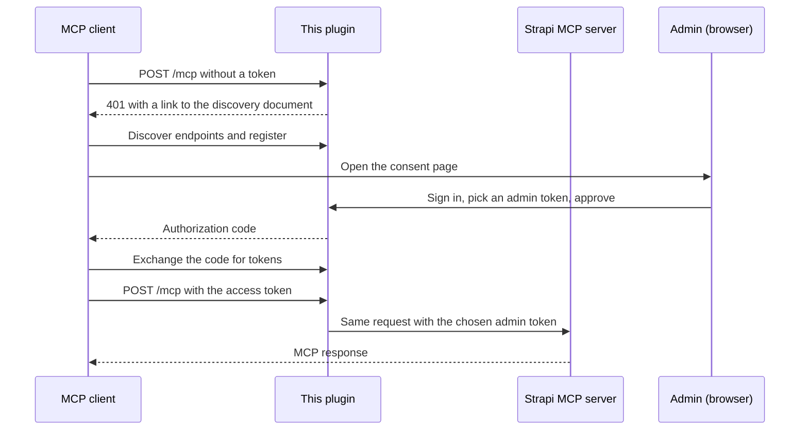

# Strapi OAuth MCP Manager

Adds OAuth sign-in to [Strapi's built-in MCP server](https://docs.strapi.io/cms/features/strapi-mcp-server), so Claude, ChatGPT, Cursor and other MCP clients can connect without a pasted token.

[](https://www.npmjs.com/package/strapi-oauth-mcp-manager) 

---

## Highlights

- **One URL to connect.** Paste `https://your-strapi.com/mcp` into an MCP client, sign in with your Strapi admin account, and pick what the client can access.
- **Permissions come from admin tokens.** Each connection uses an admin token you create in **Settings → Admin Tokens**, with exactly the permissions you give it.
- **Easy to revoke.** Deactivate a user, delete a token, or revoke a session, and access stops on the next request.
- **Uses Strapi's own MCP server.** Every tool on `/mcp` works unchanged, including the content tools Strapi generates and any tool registered with `strapi.ai.mcp.registerTool`.
- **Standards-based.** Implements the [MCP authorization spec](https://modelcontextprotocol.io/specification/latest/basic/authorization): discovery, dynamic client registration, PKCE, refresh and revocation.

---

## Overview

Strapi 5.47 added an MCP server at `/mcp`. Out of the box it accepts only admin tokens pasted into each client. Many clients, such as claude.ai connectors and ChatGPT, expect OAuth instead.

This plugin makes Strapi an OAuth authorization server for `/mcp`. When a client connects, the user signs in with their Strapi admin account and chooses one of their admin tokens. The client then gets short-lived OAuth tokens, and every request reaches Strapi's MCP server with that admin token's permissions.


---

## Quick Start

1. Install the plugin in a Strapi 5.47+ project:

   ```bash
   npm install strapi-oauth-mcp-manager
   ```

2. Turn on Strapi's MCP server in `config/server.ts`:

   ```typescript
   export default ({ env }) => ({
     host: env('HOST', '0.0.0.0'),
     port: env.int('PORT', 1337),
     app: { keys: env.array('APP_KEYS') },
     mcp: { enabled: true },
   });
   ```

3. Enable the plugin in `config/plugins.ts`, then restart Strapi:

   ```typescript
   export default () => ({
     'strapi-oauth-mcp-manager': { enabled: true },
   });
   ```

4. In the Strapi admin panel, go to **Settings → Admin Tokens** and create a token with the permissions the client should have, for example read and update on your content types.

5. Connect a client. For Claude Code:

   ```bash
   claude mcp add --transport http strapi http://localhost:1337/mcp
   ```

   Run `/mcp`, select `strapi`, and choose **Authenticate**. In the browser, sign in, choose the token from step 4, and select **Authorize**.

---

## Installation

**npm**

```bash
npm install strapi-oauth-mcp-manager
```

**yarn**

```bash
yarn add strapi-oauth-mcp-manager
```

Requirements:

- Strapi 5.47.0 or later
- `admin.secrets.encryptionKey` set in `config/admin.ts` (new projects read it from `ENCRYPTION_KEY` in `.env`)
- Node.js 20 or later

> **In production,** set `url` in `config/server.ts` to your public HTTPS address, or set `proxy: true` behind a reverse proxy. Clients use this address to find the sign-in page.

---

## Access and permissions

Every connection runs on an **admin token owned by the person who approved it**.

1. A user creates one or more admin tokens in **Settings → Admin Tokens**, each with its own permissions and expiry. For example: "Claude – content editor" and "ChatGPT – read only".
2. When a client connects, the user signs in and picks one of **their own** tokens. They can't see or pick anyone else's.
3. The client can do exactly what that token allows. Strapi already caps a token at its owner's role, so nobody can grant more than they have.

Different people can connect the same client with different access. An editor might connect with a publishing token, and an author with a draft-only token.

### Let users create tokens

Super Admins can create admin tokens by default. For other roles, go to **Settings → Administration Panel → Roles**, open the role, and on the **Settings** tab enable **Admin Tokens** (access, create, read, update, regenerate, delete). Users only ever see and manage their own tokens.

### Use full user permissions instead

To let users connect without creating a token, set `allowUserPermissions: true` (see [Configuration](#configuration)). The consent page then also offers **All of my permissions**, which creates a token carrying everything the user's role allows. It's off by default.

---

## Revoking access

| To stop… | Do this | Effect |
|---|---|---|
| Everything a person connected | Deactivate or delete their admin user | All their sessions stop immediately |
| A person's sessions, keeping their account | The person icon next to any of their sessions on the **MCP OAuth** page | All sessions they approved end |
| Everything using one access level | Delete the token in **Settings → Admin Tokens** | All sessions on that token end |
| The same, but keep the token's settings | **Regenerate** the token | All sessions on that token end |
| One connection | Revoke the session on the **MCP OAuth** page | Only that session ends |
| One app | Turn off or delete the client on the **MCP OAuth** page | All its sessions end, and it can't connect again while off |

Revoking a session never deletes the admin token the user picked.

---

## Connecting clients

Every client needs only the MCP server URL: `https://your-strapi.com/mcp`.

| Client | How to connect |
|---|---|
| Claude Code | `claude mcp add --transport http strapi https://your-strapi.com/mcp`, then `/mcp` → **Authenticate** |
| claude.ai and Claude Desktop | **Settings → Connectors → Add custom connector**. Leave the client ID and secret empty. |
| Cursor, VS Code, MCP Inspector | Add an HTTP MCP server with the URL. The client opens the sign-in page on first use. |
| ChatGPT | Add a connector with the URL and OAuth authentication. If it asks for a client ID and secret, create them as described below. |

### Clients that need a client ID and secret

1. In Strapi, open **MCP OAuth** in the sidebar and choose **Add client**.
2. Enter a name and the client's redirect URI, for example `https://chatgpt.com/connector_platform_oauth_redirect`.
3. Copy the client ID and secret into the client. The secret is shown only once.

### Clients that can't do OAuth

Send an admin token as `Authorization: Bearer <token>`. The plugin passes it to Strapi's MCP server unchanged.

---

## Signing in

The consent page accepts a **Strapi admin email and password**. Only admin accounts can connect, because Strapi's MCP server works with admin permissions.

These sign-in methods aren't supported:

- **Admin SSO.** Admins who sign in to Strapi only through an SSO provider have no password to enter.
- **Users & Permissions providers** such as GitHub or Google. These sign in front-end users, who have no admin permissions and can't use the MCP server.

---

## How it works



- Access tokens last 1 hour. Refresh tokens last 30 days and are replaced every time they're used.
- On every request the plugin checks that the session exists, the admin token still exists and hasn't been regenerated, and the approving user is still active.
- OAuth tokens and authorization codes are stored only as SHA-256 hashes. Admin token keys stay in Strapi, encrypted with `admin.secrets.encryptionKey`.

### Endpoints

| Purpose | Path |
|---|---|
| Protected resource metadata | `/.well-known/oauth-protected-resource/mcp` |
| Authorization server metadata | `/.well-known/oauth-authorization-server` |
| Consent page | `/api/strapi-oauth-mcp-manager/oauth/authorize` |
| Token | `/api/strapi-oauth-mcp-manager/oauth/token` |
| Client registration | `/api/strapi-oauth-mcp-manager/oauth/register` |
| Revocation | `/api/strapi-oauth-mcp-manager/oauth/revoke` |

---

## Configuration

All options are optional. Defaults are shown.

```typescript
export default () => ({
  'strapi-oauth-mcp-manager': {
    enabled: true,
    config: {
      accessTokenTtl: 3600, // seconds
      refreshTokenTtl: 2592000, // seconds (30 days)
      authorizationCodeTtl: 600, // seconds
      dynamicClientRegistration: true, // false = only clients added in the admin panel
      allowUserPermissions: false, // true = also offer "All of my permissions" on the consent page
      cleanupIntervalMs: 3600000, // how often expired data is removed; 0 turns it off
    },
  },
});
```

The **MCP OAuth** admin page requires the **Manage MCP OAuth clients and grants** permission, on the **Plugins** tab of each role under **Settings → Administration Panel → Roles**. Super Admins have it by default.

---

## Security

- Users can connect only with admin tokens they own. The choice is checked again when the code is exchanged.
- Clients without a secret must use PKCE (S256). Clients with a secret must send it.
- Self-registered clients may use only `https` redirect URIs, `http` on `localhost`, or native app schemes. Unused self-registered clients are removed after 30 days.
- After 5 failed sign-in attempts, an IP address and email pair is locked for 15 minutes. The count is kept in memory on each server.
- The consent page can't be framed and sends a strict Content Security Policy. The step between sign-in and approval uses a signed ticket that expires after 10 minutes and works only for that request.

---

## Troubleshooting

| Problem | Fix |
|---|---|
| `404` on `/mcp` | Set `mcp: { enabled: true }` in `config/server.ts` and use Strapi 5.47 or later. |
| The client never opens a sign-in page | Run `curl -i -X POST https://your-strapi.com/mcp`. You should get `401` with a `WWW-Authenticate` header. If the header is missing, the plugin isn't enabled. |
| "You don't have any admin tokens to connect with" | Create one in **Settings → Admin Tokens**, then choose **Refresh**. If you can't, ask an admin to enable **Admin Tokens** for your role. |
| A token is missing from the consent page | Only your own, unexpired tokens are listed. Tokens created before `ENCRYPTION_KEY` was set can't be used; regenerate them. |
| Sign-in page links use `http://` or the wrong host | Set `url` in `config/server.ts`, or `proxy: true` behind a reverse proxy. |
| "The redirect URI is not registered for this client" | For clients added in the admin panel, the redirect URI must match exactly. `*` matches any run of characters except `/`. |
| A client suddenly gets `401` | Its session was revoked, its token was deleted or regenerated, or the user was deactivated. Reconnect. |

---

## Contributing

Issues and pull requests are welcome.

```bash
npm install
npm run build   # Strapi loads the plugin from dist/, so rebuild after each change
```

End-to-end tests run against a development Strapi app that has the MCP server enabled, this plugin installed, an admin user, and an `Article` collection type with `title` and `body` fields:

```bash
BASE=http://localhost:1337 ADMIN_EMAIL=you@example.com ADMIN_PASSWORD=... npm run test:e2e
```

The tests sign in many times, so turn off the admin login rate limit in that app (`rateLimit: { enabled: false }` in `config/admin.ts`). They also create users, tokens and sessions and change the Editor and Author roles temporarily, so don't point them at production.

---

## License

MIT
