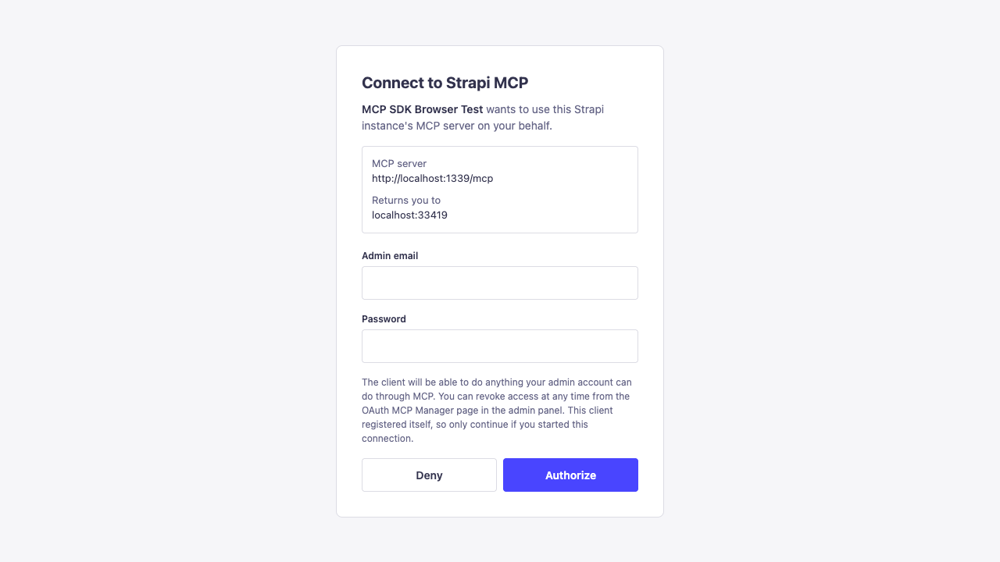
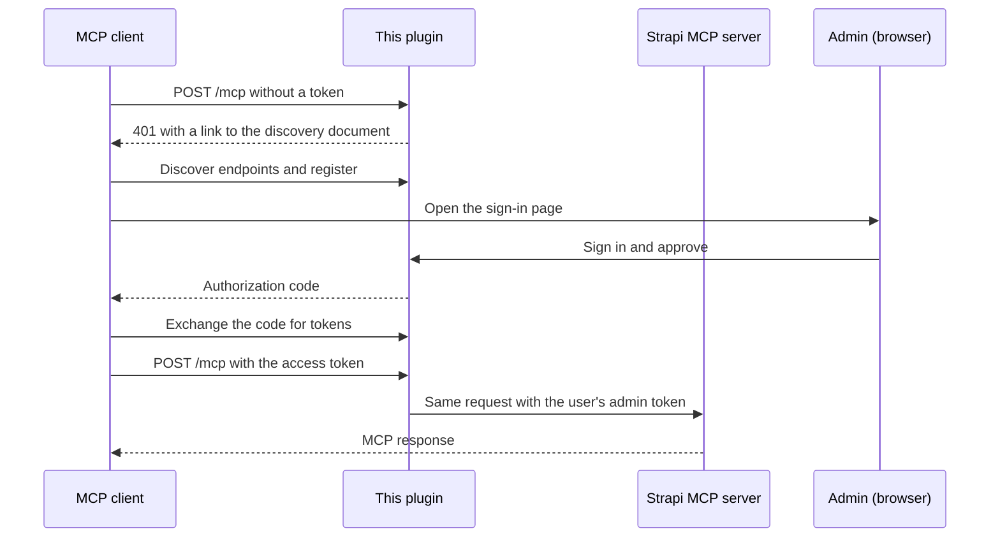

# Strapi OAuth MCP Manager

Adds OAuth sign-in to [Strapi's built-in MCP server](https://docs.strapi.io/cms/features/strapi-mcp-server), so Claude, ChatGPT, Cursor and other MCP clients can connect without a pasted API token.

[](https://www.npmjs.com/package/strapi-oauth-mcp-manager) 

---

## Highlights

- **One URL to connect.** Paste `https://your-strapi.com/mcp` into an MCP client, sign in with your Strapi admin account, and you're done.
- **Uses Strapi's own MCP server.** Every tool on `/mcp` works unchanged, including the content tools Strapi generates and any tool registered with `strapi.ai.mcp.registerTool`.
- **Scoped to the person who signed in.** A connection can do only what that admin account can do, and audit logs show the real user.
- **Revocable.** See every connected client in the admin panel and disconnect it with one click.
- **Standards-based.** Implements the [MCP authorization spec](https://modelcontextprotocol.io/specification/latest/basic/authorization): discovery, dynamic client registration, PKCE, refresh and revocation.

---

## Overview

Strapi 5.47 added an MCP server at `/mcp`. Out of the box it accepts only admin API tokens, so every user has to create a token and paste it into each client. Many clients, such as claude.ai connectors and ChatGPT, expect OAuth instead.

This plugin makes Strapi an OAuth authorization server for `/mcp`. When a client connects without a token, it's sent to a Strapi sign-in page. After the user approves, the client gets short-lived tokens, and each request reaches Strapi's MCP server with the user's own permissions.



---

## Quick Start

1. Install the plugin in a Strapi 5.47+ project:

   ```bash
   npm install strapi-oauth-mcp-manager
   ```

2. Turn on Strapi's MCP server in `config/server.ts`:

   ```typescript
   export default ({ env }) => ({
     host: env('HOST', '0.0.0.0'),
     port: env.int('PORT', 1337),
     app: { keys: env.array('APP_KEYS') },
     mcp: { enabled: true },
   });
   ```

3. Enable the plugin in `config/plugins.ts`, then restart Strapi:

   ```typescript
   export default () => ({
     'strapi-oauth-mcp-manager': { enabled: true },
   });
   ```

4. Connect a client. For Claude Code:

   ```bash
   claude mcp add --transport http strapi http://localhost:1337/mcp
   ```

   Run `/mcp`, select `strapi`, and choose **Authenticate**. Sign in with your Strapi admin email and password in the browser window that opens.

---

## Installation

**npm**

```bash
npm install strapi-oauth-mcp-manager
```

**yarn**

```bash
yarn add strapi-oauth-mcp-manager
```

Requirements:

- Strapi 5.47.0 or later
- `admin.secrets.encryptionKey` set in `config/admin.ts` (new projects read it from `ENCRYPTION_KEY` in `.env`)
- Node.js 20 or later

> **In production,** set `url` in `config/server.ts` to your public HTTPS address, or set `proxy: true` behind a reverse proxy. Clients use this address to find the sign-in page.

---

## Connecting clients

Every client needs only the MCP server URL: `https://your-strapi.com/mcp`.

| Client | How to connect |
|---|---|
| Claude Code | `claude mcp add --transport http strapi https://your-strapi.com/mcp`, then `/mcp` → **Authenticate** |
| claude.ai and Claude Desktop | **Settings → Connectors → Add custom connector**. Leave the client ID and secret empty. |
| Cursor, VS Code, MCP Inspector | Add an HTTP MCP server with the URL. The client opens the sign-in page on first use. |
| ChatGPT | Add a connector with the URL and OAuth authentication. If it asks for a client ID and secret, create them as described below. |

### Clients that need a client ID and secret

1. In Strapi, open **MCP OAuth** in the sidebar and choose **Add client**.
2. Enter a name and the client's redirect URI, for example `https://chatgpt.com/connector_platform_oauth_redirect`.
3. Copy the client ID and secret into the client. The secret is shown only once.

### Clients that can't do OAuth

Send a Strapi admin API token as `Authorization: Bearer <token>`. The plugin passes it to Strapi's MCP server unchanged.

---

## Signing in

The sign-in page accepts a **Strapi admin email and password**. Only admin accounts can connect, because Strapi's MCP server works with admin permissions.

These sign-in methods aren't supported:

- **Admin SSO.** Admins who sign in to Strapi only through an SSO provider have no password to enter.
- **Users & Permissions providers** such as GitHub or Google. These sign in front-end users, who have no admin permissions and can't use the MCP server.

---

## How it works



- Each approval creates an admin API token owned by the user who signed in, with that user's permissions. Strapi updates it when the user's roles change and deletes it when the user is removed.
- Access tokens last 1 hour. Refresh tokens last 30 days and are replaced every time they're used.
- Tokens and authorization codes are stored only as SHA-256 hashes.
- Disconnecting a session, turning off its client, or deleting its admin token under **Settings → API Tokens** ends the connection.

### Endpoints

| Purpose | Path |
|---|---|
| Protected resource metadata | `/.well-known/oauth-protected-resource/mcp` |
| Authorization server metadata | `/.well-known/oauth-authorization-server` |
| Sign-in page | `/api/strapi-oauth-mcp-manager/oauth/authorize` |
| Token | `/api/strapi-oauth-mcp-manager/oauth/token` |
| Client registration | `/api/strapi-oauth-mcp-manager/oauth/register` |
| Revocation | `/api/strapi-oauth-mcp-manager/oauth/revoke` |

---

## Configuration

All options are optional. Defaults are shown.

```typescript
export default () => ({
  'strapi-oauth-mcp-manager': {
    enabled: true,
    config: {
      accessTokenTtl: 3600, // seconds
      refreshTokenTtl: 2592000, // seconds (30 days)
      authorizationCodeTtl: 600, // seconds
      dynamicClientRegistration: true, // false = only clients added in the admin panel
      cleanupIntervalMs: 3600000, // how often expired data is removed; 0 turns it off
    },
  },
});
```

The **MCP OAuth** admin page requires the **Manage MCP OAuth clients and grants** permission, on the **Plugins** tab of each role under **Settings → Administration Panel → Roles**. Super Admins have it by default.

---

## Security

- Clients without a secret must use PKCE (S256). Clients with a secret must send it.
- Self-registered clients may use only `https` redirect URIs, `http` on `localhost`, or native app schemes. Unused self-registered clients are removed after 30 days.
- After 5 failed sign-in attempts, an IP address and email pair is locked for 15 minutes. The count is kept in memory on each server.
- The sign-in page can't be framed and sends a strict Content Security Policy.

---

## Troubleshooting

| Problem | Fix |
|---|---|
| `404` on `/mcp` | Set `mcp: { enabled: true }` in `config/server.ts` and use Strapi 5.47 or later. |
| The client never opens a sign-in page | Run `curl -i -X POST https://your-strapi.com/mcp`. You should get `401` with a `WWW-Authenticate` header. If the header is missing, the plugin isn't enabled. |
| Sign-in page links use `http://` or the wrong host | Set `url` in `config/server.ts`, or `proxy: true` behind a reverse proxy. |
| "encryptionKey is not configured" | Add `ENCRYPTION_KEY` to `.env` and `secrets: { encryptionKey: env('ENCRYPTION_KEY') }` to `config/admin.ts`. |
| "The redirect URI is not registered for this client" | For clients added in the admin panel, the redirect URI must match exactly. `*` matches any run of characters except `/`. |
| A client lost access to some tools | The approving user's permissions changed. Grant the permissions again, or reconnect as a different user. |

---

## Contributing

Issues and pull requests are welcome.

```bash
npm install
npm run build   # Strapi loads the plugin from dist/, so rebuild after each change
```

End-to-end tests run against a development Strapi app that has the MCP server enabled, this plugin installed, and an admin user:

```bash
BASE=http://localhost:1337 ADMIN_EMAIL=you@example.com ADMIN_PASSWORD=... npm run test:e2e
```

The tests create and revoke clients and sessions, so don't point them at production.

---

## License

MIT
