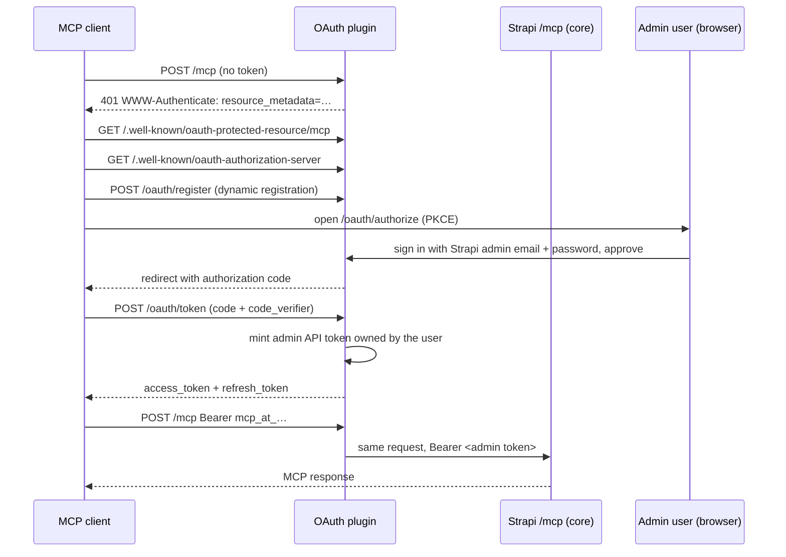

# Strapi OAuth MCP Manager

OAuth 2.1 for [Strapi's built-in MCP server](https://docs.strapi.io/cms/features/strapi-mcp-server). Claude, ChatGPT, Cursor and other MCP clients connect to `https://your-strapi.com/mcp` by signing in with a Strapi admin account. Nobody has to create or paste an API token.

Out of the box, Strapi's `/mcp` endpoint only accepts admin API tokens that you paste into each client. This plugin adds the OAuth layer MCP clients expect: discovery, a sign-in and consent page, dynamic client registration, and short-lived tokens you can revoke.

## Features

- **Works with the official `/mcp` endpoint.** No custom MCP transport. Core's CRUD tools and any tools you register with `strapi.ai.mcp.registerTool` work unchanged.
- **Sign in with Strapi.** The consent page checks the user's Strapi admin email and password.
- **Scoped to the person who approved.** Each connection gets its own admin API token, owned by that user and limited to their permissions. Audit logs and `createdBy` show the real user.
- **Spec-compliant discovery.** Implements RFC 9728 (protected resource metadata), RFC 8414 (authorization server metadata), RFC 7591 (dynamic client registration), RFC 7636 (PKCE, S256) and RFC 7009 (revocation).
- **Admin page.** See connected sessions, revoke them, and add client ID + secret pairs for clients that need them.
- **Admin tokens still work.** A pasted admin API token passes straight through to core.

## Requirements

- Strapi **5.47.0 or later** (the MCP server shipped in 5.47)
- `admin.secrets.encryptionKey` configured (new Strapi projects have `ENCRYPTION_KEY` in `.env`)
- Node.js 20+

## Installation

```bash
npm install strapi-oauth-mcp-manager
```

Enable Strapi's MCP server in `config/server.ts`:

```typescript
export default ({ env }) => ({
  host: env('HOST', '0.0.0.0'),
  port: env.int('PORT', 1337),
  app: { keys: env.array('APP_KEYS') },
  mcp: {
    enabled: true,
  },
});
```

Enable the plugin in `config/plugins.ts`:

```typescript
export default () => ({
  'strapi-oauth-mcp-manager': {
    enabled: true,
  },
});
```

Restart Strapi. The log should show:

```
[strapi-oauth-mcp-manager] OAuth enabled for /mcp
[MCP] Server available at /mcp
```

> **Behind a proxy or in production:** set `url` in `config/server.ts` (for example `url: env('PUBLIC_URL')`) so the discovery documents advertise your public HTTPS address. Otherwise set `proxy: true` so Strapi trusts `X-Forwarded-*` headers.

## Connecting a client

Give the client your MCP server URL, `https://your-strapi.com/mcp`. The client finds the rest on its own.

### Claude Code

```bash
claude mcp add --transport http strapi https://your-strapi.com/mcp
```

Run `/mcp` in Claude Code, pick `strapi`, and choose **Authenticate**. A browser opens on the Strapi sign-in page.

### Claude (claude.ai and Claude Desktop)

**Settings → Connectors → Add custom connector**, then paste `https://your-strapi.com/mcp`. Leave the OAuth client ID and secret empty; Claude registers itself.

### ChatGPT

ChatGPT can register itself too. If your setup asks for a client ID and secret:

1. In Strapi, open **MCP OAuth** in the sidebar and choose **Add client**.
2. Name it `ChatGPT`, add the redirect URI `https://chatgpt.com/connector_platform_oauth_redirect`, and keep **Confidential** selected.
3. Copy the client ID and secret (the secret is shown once).
4. In ChatGPT, add a connector with the MCP server URL `https://your-strapi.com/mcp`, **OAuth** authentication, and the client ID and secret.

### Cursor, VS Code, MCP Inspector

Add an HTTP MCP server with the URL `https://your-strapi.com/mcp`. These clients start the OAuth flow when they get the first `401`.

### Using an admin token instead

Clients that can't do OAuth can still send a Strapi admin API token (**Settings → API Tokens**, admin kind) as `Authorization: Bearer <token>`. The plugin passes it through to core untouched.

## How it works



The plugin adds a Koa middleware in front of core's `POST /mcp` route:

| Incoming `Authorization` header | What happens |
|---|---|
| Missing | `401` with `WWW-Authenticate: Bearer resource_metadata="…"` so the client can start OAuth |
| `Bearer mcp_at_…` (issued by this plugin) | Looked up by hash. If it's valid, the header is replaced with the admin token behind the grant and core handles the request. If it's expired or revoked, `401` with `error="invalid_token"` |
| Any other bearer token | Passed to core unchanged |

Each approval creates a **grant**: an access token (1 hour), a refresh token (30 days, rotated on every use), and an admin API token named `MCP OAuth · <client> · <email> · <id>`. That admin token carries the approving user's permissions. Strapi keeps it in sync when the user's roles change and deletes it if the user is removed. Revoking the session, deactivating the client, or deleting the admin token under **Settings → API Tokens** all disconnect the client.

OAuth access tokens, refresh tokens and authorization codes are stored only as SHA-256 hashes. The admin token's key is stored by Strapi, encrypted with `admin.secrets.encryptionKey`.

## Endpoints

| Endpoint | Path |
|---|---|
| Protected resource metadata | `GET /.well-known/oauth-protected-resource/mcp` (also served at `/.well-known/oauth-protected-resource`) |
| Authorization server metadata | `GET /.well-known/oauth-authorization-server` |
| Authorization (sign-in page) | `GET/POST /api/strapi-oauth-mcp-manager/oauth/authorize` |
| Token | `POST /api/strapi-oauth-mcp-manager/oauth/token` |
| Dynamic client registration | `POST /api/strapi-oauth-mcp-manager/oauth/register` |
| Revocation | `POST /api/strapi-oauth-mcp-manager/oauth/revoke` |

## Configuration

All options are optional:

```typescript
export default () => ({
  'strapi-oauth-mcp-manager': {
    enabled: true,
    config: {
      accessTokenTtl: 3600, // seconds
      refreshTokenTtl: 2592000, // seconds (30 days)
      authorizationCodeTtl: 600, // seconds
      dynamicClientRegistration: true, // let clients register themselves
      cleanupIntervalMs: 3600000, // purge expired codes/grants hourly; 0 disables
    },
  },
});
```

Set `dynamicClientRegistration: false` to accept only clients you add on the **MCP OAuth** page.

## Permissions

The **MCP OAuth** admin page and its API require the **Plugins → strapi-oauth-mcp-manager → Manage MCP OAuth clients and grants** permission. Super Admins have it by default.

Anyone with a Strapi admin account can approve a connection. The client can do only what that account can do.

## Security notes

- The sign-in form locks an IP and email pair for 15 minutes after 5 failed attempts. The counter lives in memory on each server instance.
- Public clients (no secret) must use PKCE with S256. Confidential clients must authenticate with their secret.
- Self-registered clients may use only `https` redirect URIs, `http` on `localhost`, or native app schemes, and no wildcards. Self-registered clients that go unused for a full refresh-token lifetime are deleted automatically.
- The consent page sends `X-Frame-Options: DENY` and a strict Content Security Policy.
- Admin users who sign in only through SSO have no password, so they can't use the sign-in page yet.

## Troubleshooting

| Symptom | Fix |
|---|---|
| `404` on `/mcp` | Set `server.mcp.enabled: true` and make sure Strapi is 5.47+. |
| The client never opens a browser | Check `curl -i -X POST https://your-strapi.com/mcp`. It should return `401` with a `WWW-Authenticate` header. If the header is missing, the plugin isn't enabled. |
| Discovery URLs show `http://` or the wrong host | Set `server.url` to your public URL, or set `server.proxy: true` behind a reverse proxy. |
| `encryptionKey is not configured` | Add `ENCRYPTION_KEY` to `.env` and `secrets: { encryptionKey: env('ENCRYPTION_KEY') }` to `config/admin.ts`. |
| "The redirect URI is not registered for this client" | For clients you added by hand, the redirect URI must match exactly (or match a `*` pattern). |
| A client stopped working after someone changed roles | Its admin token was clamped to the new permissions. Reconnect, or grant the missing permissions. |

## Upgrading from 0.x

Version 1.0 targets Strapi's official `/mcp` endpoint and drops the old convention of protecting `/api/<plugin>/mcp` routes.

- Plugins that ran their own MCP transport (`yt-transcript-strapi-plugin`, `strapi-content-mcp`) should register their tools with `strapi.ai.mcp.registerTool` instead. The official server then serves them at `/mcp`.
- The OAuth client, code and token tables changed. Existing OAuth tokens stop working, and clients reconnect through the sign-in page.
- `strapiApiToken` on the OAuth client is gone. Each connection now gets its own admin token owned by the user who approved it.
- Discovery moved from `/api/strapi-oauth-mcp-manager/.well-known/*` to the server root.

## Development

```bash
npm install
npm run build        # the plugin loads from dist/, so rebuild after every change
npm run watch:link   # or link into a local Strapi app with yalc
```

End-to-end tests run against a live Strapi app that has MCP enabled, this plugin installed, and an admin user:

```bash
BASE=http://localhost:1337 ADMIN_EMAIL=you@example.com ADMIN_PASSWORD=… npm run test:e2e
```

They register clients, create sessions and revoke them, so point them at a development instance only.

## License

MIT
